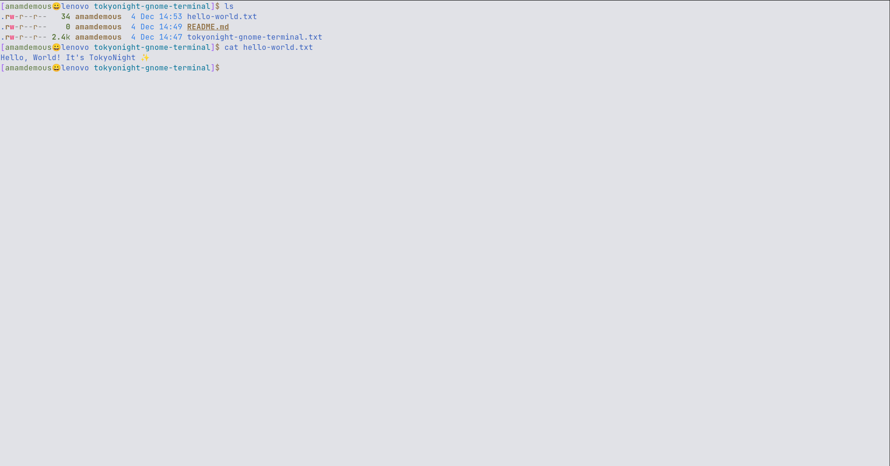
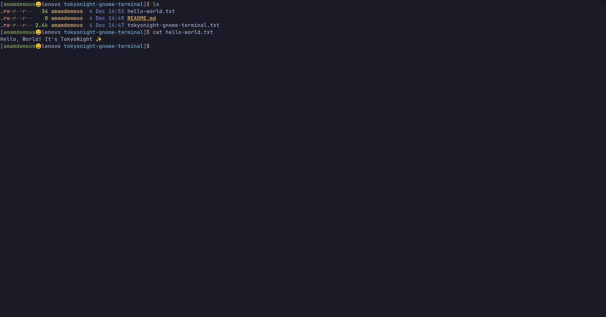
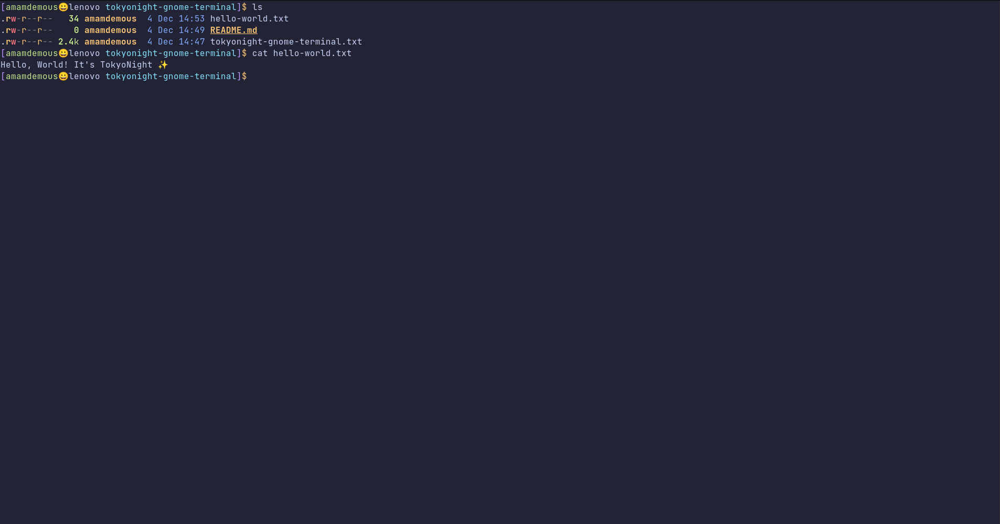
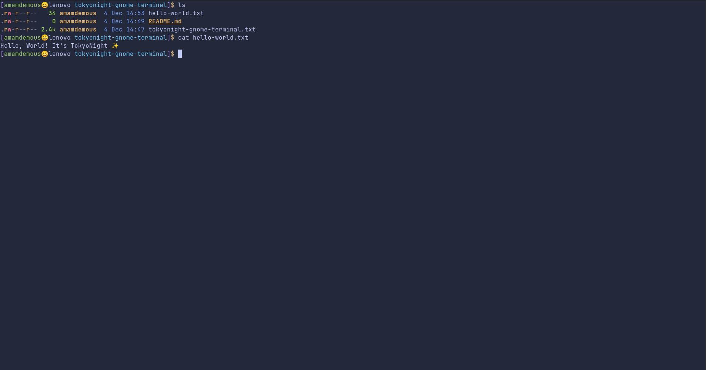

# Tokyo Night
A dark and light gnome terminal theme ported from the Visual Studio Code TokyoNight theme.

## Installation
Use dconf tool to load the settings from txt file
```
dconf load /org/gnome/terminal/ < tokyonight-gnome-terminal.txt
```

## Day


## Dark


## Moon


## Storm


Font used in screenshots: [JetBrains Mono](https://www.jetbrains.com/lp/mono/)